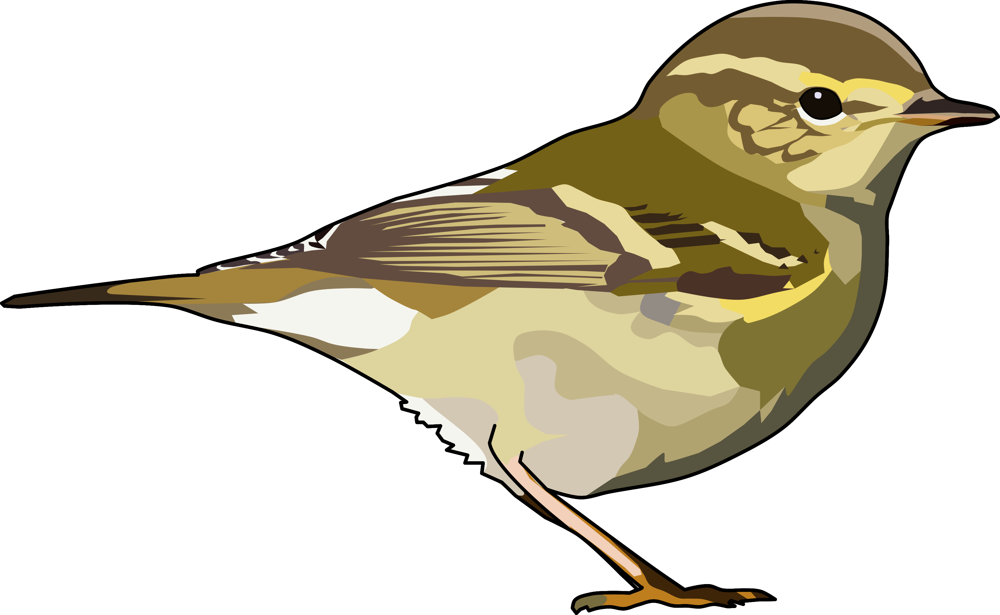

# Understanding connectivty in *Phylloscopus* warblers
Analysis to understand migratory connectivity of three *Phylloscupus* taxa during post-breeding migration in Western Europe. 
Using stable hydrogen isotopes we compare isotopic signatures at a stopover in West Cornwall, Britain between nominate Common Chiffchaffs *Phylloscopus collybita collybita*, Siberian Chiffchaffs *Phylloscopus collybita tristis* and Yellow-browed Warbler *Phylloscupus inornatus*.

  

## *Authors*
- Luke Ozsanlav-Harris 
- Robbie Phillips 
- Jake Bailey
- Liam Langley 
- Kester Wilson
- Richard Inger 
- Stuart Bearhop 

## Repo Structure
- `Data`: Data from Jake and Robbie, 2 files both read into code at the start
- `Code`: Code to run the analysis and create the range maps in the MS
- `Outputs`: Contains all the figures in the main manuscript
- `Spatial`: Contains the spatial data to create Figures 1-2
     
     
     
## Abstract

Understanding migratory connectivity is fundamental to interpreting range dynamics and understanding the drivers of population change. 
Stable hydrogen isotope ratios can be used to infer the provenance of individual migrants due to predictable broad-scale spatial trends. 
We compare hydrogen isotopes (δ2H) among and within three *Phylloscopus* taxa occurring in Britain during post-breeding migration to understand patterns of connectivity. 
We found that δ2H values of Common Chiffchaffs *Phylloscopus collybita collybita* were significantly different and non-overlapping compared to both Siberian Chiffchaffs *Phylloscopus collybita tristis* and Yellow-browed Warblers *Phylloscopus inornatus* but there was no difference between Siberian Chiffchaffs and Yellow-browed Warblers. 
There was a significant negative correlation between wing length and δ2H in the western Common Chiffchaffs. 
A negative but weakly supported trend between wing length and δ2H was also found in Yellow-browed Warblers with no relationship found in Siberian Chiffchaffs. 
Our results suggest broad geographic structuring within Common Chiffchaffs passing through Britain but weak evidence for this in Yellow-browed Warblers and Siberian Chiffchaffs. 
The origins of Yellow-browed Warblers and Siberian Chiffchaffs are likely largely overlapping and unlikely to be isolated to the western range edge. 

     

## Review process

Link to orginal pre-print: [click here](https://www.authorea.com/users/574634/articles/628617-exploring-the-origins-of-vagrant-yellow-browed-warblers-in-western-europe).
